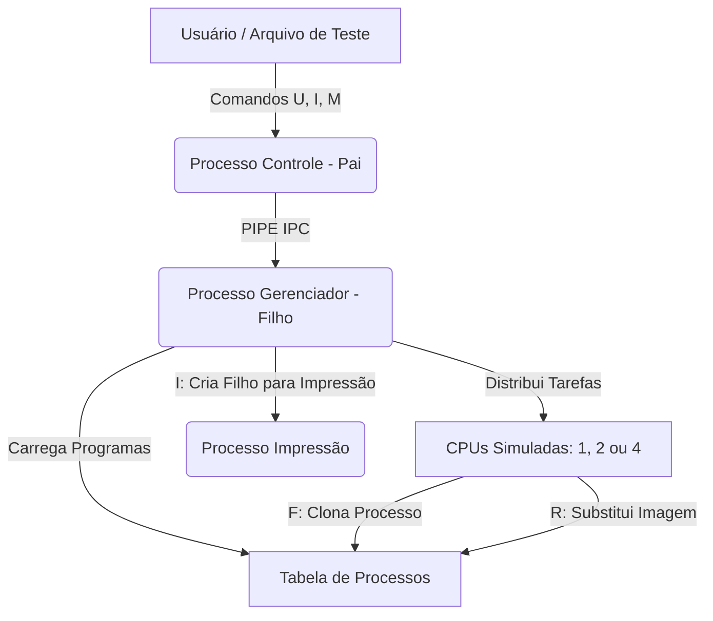

# 🖥️ Simulador de Gerenciamento de Processos

Este projeto consiste em um **Simulador de Gerenciamento de Processos** altamente configurável desenvolvido em C para a disciplina de **Sistemas Operacionais (TP1)**. O simulador replica o comportamento de um sistema operacional real ao gerenciar múltiplos processos concorrentes, estados de execução, trocas de contexto, paginação de CPU e comunicação via Pipes de IPC (Inter-Process Communication).

---

## 🚀 Recursos Principais

- **Arquitetura Multiprocessada**: Suporte para simulação de **1, 2 ou 4 CPUs** simultâneas e independentes.
- **Políticas de Escalonamento**:
  - **FIFO (First-In, First-Out)**: Escalonamento não-preemptivo por ordem de chegada.
  - **MLFQ (Multi-Level Feedback Queue)**: Escalonamento preemptivo com 4 níveis de prioridade (filas de prontos com quantums dinâmicos: 1, 2, 4 e 8 unidades de tempo).
- **Comunicação por IPC (Pipes)**: Arquitetura dividida em dois processos reais Linux:
  - **Processo Controle (Pai)**: Interage com o usuário (ou lê arquivos de comandos) e envia requisições via Pipe.
  - **Gerenciador de Processos (Filho)**: Recebe comandos via Pipe e gerencia a simulação física.
- **Simulação Completa de Instruções**: Conjunto de instruções simuladas que realizam operações aritméticas em registradores virtuais locais, operações de E/S (`B`), criação de processos filhos (`F`), e substituição de imagem (`R`).

---

## 📐 Arquitetura do Sistema

O simulador utiliza uma divisão clássica baseada em processos UNIX reais para simular a concorrência a nível de software:



- **Processo Controle (Pai)**: Responsável pela interface inicial para configurar o escalonador e o número de CPUs, bem como enviar os comandos de iteração/impressão para o gerenciador.
- **Processo Gerenciador (Filho)**: Mantém o estado global da simulação, contendo o relógio lógico, as filas de estados (`Pronto`, `Executando`, `Bloqueado` e `Terminado`), a tabela de processos e o estado atual de cada CPU virtualizada.

---

## 📝 Conjunto de Instruções Simuladas

Os arquivos dentro do diretório `data/` representam programas a serem executados pelos processos simulados. Cada processo possui seu próprio conjunto de registradores virtuais (uma tabela de variáveis locais de índice `0` a `31`).

As instruções disponíveis são:

| Instrução | Parâmetros | Descrição | Exemplo |
| :--- | :--- | :--- | :--- |
| **`N`** | `n` | Aloca/Reserva espaço para `n` registradores locais. | `N 2` (Define que o processo possui 2 variáveis) |
| **`D`** | `x` | Define o registrador `x` para zero. | `D 0` (Registrador `0` recebe `0`) |
| **`V`** | `x n` | Atribui o valor `n` ao registrador `x`. | `V 1 500` (Registrador `1` recebe `500`) |
| **`A`** | `x n` | Soma `n` ao registrador `x` (`var[x] = var[x] + n`). | `A 0 10` (Soma `10` à variável `0`) |
| **`S`** | `x n` | Subtrai `n` do registrador `x` (`var[x] = var[x] - n`). | `S 1 50` (Subtrai `50` da variável `1`) |
| **`B`** | `n` | Bloqueia o processo por `n` ciclos de clock simulados (Operação de E/S). | `B 3` (Bloqueia por `3` unidades de tempo) |
| **`R`** | `caminho` | Substitui a imagem do processo pelo programa em `data/caminho` (`exec` simulado). | `R file_a` (Substitui imagem pelo script `data/file_a.txt`) |
| **`F`** | `n` | Clona o processo atual (`fork` simulado). O processo-filho inicia na instrução imediatamente seguinte; o pai salta `n` instruções adiante. | `F 1` (Cria processo filho) |
| **`T`** | *Nenhum* | Termina o processo corrente. | `T` (Finaliza a execução) |

---

## 🛠️ Organização do Projeto

```bash
SO-TP1-Simulador-Processos/
├── bin/                       # Executável compilado (.bin)
├── obj/                       # Objetos gerados na compilação (.o)
├── include/                   # Cabeçalhos do sistema (.h)
│   ├── Cpu.h
│   ├── Escalonador.h
│   ├── Fila.h
│   ├── GerenciadorProcesso.h
│   └── ...
├── src/                       # Implementação dos módulos (.c)
│   ├── Cpu.c
│   ├── Escalonador.c
│   ├── GerenciadorProcesso.c
│   ├── main.c
│   └── ...
├── data/                      # Arquivos de instruções virtuais (.txt)
│   ├── init.txt               # Programa de inicialização principal
│   ├── file_a.txt
│   └── ...
├── tests/                     # Sequências de comandos de entrada
│   └── test.txt
├── makefile                   # Script de automação do GCC
└── README.md                  # Documentação do sistema
```

---

## 📥 Como Compilar e Executar

### Pré-requisitos
- Sistema operacional Linux ou WSL (Windows Subsystem for Linux).
- Compilador GCC.
- Utilitário Make.

### Compilação
No diretório raiz do projeto, compile o programa utilizando o Makefile:

```bash
# Limpa arquivos compilados anteriores e compila novamente
make clean && make
```

### Execução

Você pode rodar o simulador em dois modos principais:

#### 1. Modo Interativo (Manual)
O simulador pedirá dinamicamente as opções de escalonamento e de CPUs, e você poderá digitar os comandos um a um no terminal.

```bash
# Executa o simulador interativamente
./bin/simulator
```

#### 2. Modo Batch (Leitura de Arquivo)
Você pode passar um arquivo de testes contendo comandos pré-definidos como argumento.

```bash
# Executa lendo os comandos estruturados
./bin/simulator tests/test.txt
```

---

## 🎮 Protocolo de Comandos do Pipe

Quando a simulação está ativa, o **Processo Controle** fica aguardando comandos para interagir com o **Gerenciador de Processos**:

- **`U` (Update)**: Avança o relógio simulado do SO em 1 unidade de tempo.
  - Executa uma instrução nas CPUs ativas.
  - Decrementa os tempos de processos na fila de bloqueados.
  - Efetua trocas de contexto necessárias (e.g. quantum esgotado no MLFQ).
- **`I` (Impressão)**: Dispara um processo filho (`ProcessoImpressao`) para tirar um snapshot em tempo real do sistema. O usuário pode escolher o que quer visualizar:
  1. Todos os processos na tabela
  2. Processos em execução (CPUs ativas)
  3. Fila de prontos
  4. Fila de bloqueados
  5. Informações gerais e estatísticas
- **`M` (Finalizar)**: Encerra a simulação exibindo o estado final de todos os processos e estatísticas gerais (processos criados, finalizados, tempo de CPU total, etc.).

---

## 👥 Autores
Desenvolvido como projeto prático para a disciplina de Sistemas Operacionais.
