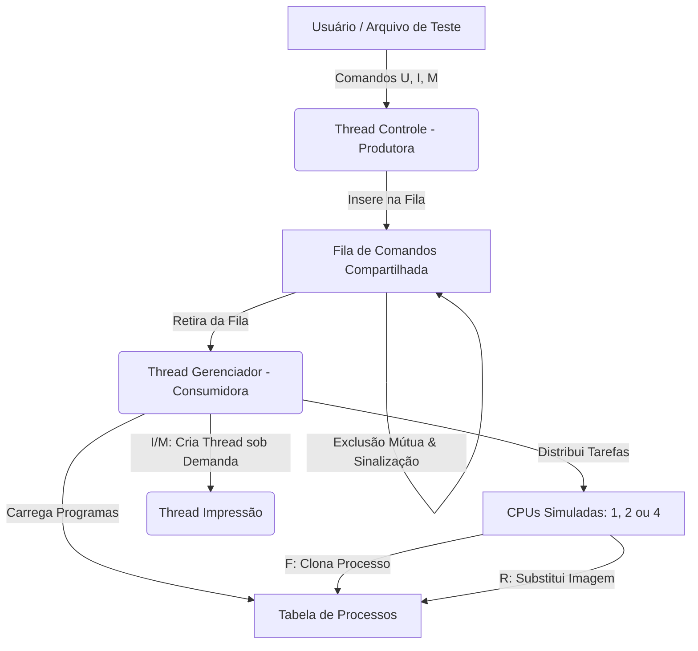

# 🖥️ Simulador de Gerenciamento de Processos Concorrente (pthreads)

Este projeto consiste em um **Simulador de Gerenciamento de Processos** altamente configurável desenvolvido em C para a disciplina de **Sistemas Operacionais (TP1)**. O simulador replica o comportamento de um sistema operacional real ao gerenciar múltiplos processos concorrentes, estados de execução, trocas de contexto, paginação de CPU e sincronização segura de threads utilizando a biblioteca **POSIX Threads (pthreads)**.

---

## 🚀 Recursos Principais

- **Arquitetura Multiprocessada**: Suporte para simulação de **1, 2 ou 4 CPUs** virtuais simultâneas e independentes.
- **Políticas de Escalonamento**:
  - **FIFO (First-In, First-Out)**: Escalonamento não-preemptivo por ordem de chegada.
  - **MLFQ (Multi-Level Feedback Queue)**: Escalonamento preemptivo com 4 níveis de prioridade (filas de prontos com quantums dinâmicos: 1, 2, 4 e 8 unidades de tempo).
- **Concorrência a Nível de Threads (pthreads)**: Arquitetura concorrente redesenhada para operar em um único espaço de endereçamento de memória utilizando a API POSIX:
  - **Thread Controle (Produtora)**: Interage com o usuário (ou lê arquivos de comandos) de forma independente e insere as requisições na fila de comandos.
  - **Thread Gerenciador (Consumidora)**: Retira e processa os comandos da fila compartilhada, gerenciando a simulação física do SO.
  - **Thread de Impressão (On-Demand)**: Criada de forma dinâmica a cada solicitação de snapshot para exibir informações do sistema concorrentemente sem travar o processador de simulação principal.
- **Sincronização de Threads via Monitor**: Comunicação altamente eficiente e thread-safe implementada por meio de uma Fila de Comandos sincronizada com **Mutexes** e **Variáveis de Condição**, eliminando busy-waiting (espera ativa).
- **Simulação Completa de Instruções**: Conjunto de instruções simuladas que realizam operações aritméticas em registradores virtuais locais, operações de E/S (`B`), criação de processos filhos (`F`), e substituição de imagem (`R`).

---

## 📐 Arquitetura do Sistema

O simulador utiliza uma divisão baseada em threads POSIX (`pthreads`) para simular a concorrência a nível de software compartilhando o mesmo espaço de memória:



- **Thread Controle (Produtora)**: Responsável pela interface inicial para configurar o escalonador e o número de CPUs, bem como receber os comandos de iteração/impressão e enviá-los de forma segura para a fila de comandos compartilhada.
- **Fila de Comandos Compartilhada (`FilaComandos`)**: Atua como o meio de comunicação monitorizado e thread-safe. Protegida por exclusão mútua, garante que inserções e remoções de comandos ocorram sem condições de corrida.
- **Thread Gerenciador (Consumidora)**: Mantém o estado global da simulação, contendo o relógio lógico, as filas de estados (`Pronto`, `Executando`, `Bloqueado` e `Terminado`), a tabela de processos e o estado atual de cada CPU virtualizada.
- **Thread de Impressão (On-Demand)**: Disparada dinamicamente sob demanda para tirar snapshots estruturados do sistema concorrentemente, realizando a renderização das telas e sincronizando o fluxo com `pthread_join`.

---

## 🔒 Mecanismos de Sincronização Utilizados

Para garantir que a comunicação entre threads ocorra de forma perfeitamente coordenada e livre de inconsistências de memória, foram empregados os seguintes recursos da biblioteca `pthread`:

1. **`pthread_mutex_t` (Exclusão Mútua)**: Utilizado para bloquear o acesso simultâneo à fila compartilhada de comandos (`FilaComandos.mutex`), garantindo que apenas uma thread possa escrever ou ler da estrutura por vez.
2. **`pthread_cond_t` (Variável de Condição)**: A Thread Gerenciador entra em repouso eficiente (`pthread_cond_wait`) quando não há comandos disponíveis. Assim que a Thread Controle insere um comando (`U`, `I` ou `M`), ela emite um sinal (`pthread_cond_signal`) para acordar a Thread Gerenciador imediatamente.
3. **`pthread_join` (Sincronização de Junção)**: Usado para garantir que a Thread Gerenciador espere pela finalização completa da Thread de Impressão antes de retomar a simulação, evitando a sobreposição desordenada de caracteres no console.

---

## 📝 Conjunto de Instruções Simuladas

Os arquivos dentro do diretório `data/` representam programas a serem executados pelos processos simulados. Cada processo possui seu próprio conjunto de registradores virtuais (uma tabela de variáveis locais de índice `0` a `31`).

As instruções disponíveis são:

| Instrução | Parâmetros | Descrição | Exemplo |
| :--- | :--- | :--- | :--- |
| **`N`** | `n` | Aloca/Reserva espaço para `n` registradores locais. | `N 2` (Define que o processo possui 2 variáveis) |
| **`D`** | `x` | Define o registrador `x` para zero. | `D 0` (Registrador `0` recebe `0`) |
| **`V`** | `x n` | Atribui o valor `n` ao registrador `x`. | `V 1 500` (Registrador `1` recebe `500`) |
| **`A`** | `x n` | Soma `n` ao registrador `x` (`var[x] = var[x] + n`). | `A 0 10` (Soma `10` à variável `0`) |
| **`S`** | `x n` | Subtrai `n` do registrador `x` (`var[x] = var[x] - n`). | `S 1 50` (Subtrai `50` da variável `1`) |
| **`B`** | `n` | Bloqueia o processo por `n` ciclos de clock simulados (Operação de E/S). | `B 3` (Bloqueia por `3` unidades de tempo) |
| **`R`** | `caminho` | Substitui a imagem do processo pelo programa em `data/caminho` (`exec` simulado). | `R file_a` (Substitui imagem pelo script `data/file_a.txt`) |
| **`F`** | `n` | Clona o processo atual (`fork` simulado). O processo-filho inicia na instrução imediatamente seguinte; o pai salta `n` instruções adiante. | `F 1` (Cria processo filho) |
| **`T`** | *Nenhum* | Termina o processo corrente. | `T` (Finaliza a execução) |

---

## 🛠️ Organização do Projeto

```bash
SO-TP1-Simulador-Processos/
├── bin/                       # Executável compilado
├── obj/                       # Objetos gerados na compilação (.o)
├── include/                   # Cabeçalhos do sistema (.h)
│   ├── Cpu.h
│   ├── Escalonador.h
│   ├── Fila.h
│   ├── FilaComandos.h         # Estrutura da Fila monitorada com threads
│   ├── Globais.h              # Declarações globais (Fila, mutexes)
│   ├── GerenciadorProcesso.h
│   └── ...
├── src/                       # Implementação dos módulos (.c)
│   ├── Cpu.c
│   ├── Escalonador.c
│   ├── FilaComandos.c         # Operações thread-safe da fila de comandos
│   ├── Globais.c              # Inicialização de mutexes e condvars
│   ├── GerenciadorProcesso.c
│   ├── main.c                 # Inicialização das threads Controle e Gerenciador
│   └── ...
├── data/                      # Arquivos de instruções virtuais (.txt)
│   ├── init.txt               # Programa de inicialização principal
│   ├── file_a.txt
│   └── ...
├── tests/                     # Sequências de comandos de entrada
│   └── test.txt
├── makefile                   # Script de automação do GCC contendo a flag -lpthread
└── README.md                  # Documentação do sistema
```

---

## 📥 Como Compilar e Executar

### Pré-requisitos
- Sistema operacional Linux ou WSL (Windows Subsystem for Linux).
- Compilador GCC instalado.
- Utilitário Make.

### Compilação
No diretório raiz do projeto, compile o programa utilizando o Makefile (a flag `-lpthread` já está embutida nas definições de compilação):

```bash
# Limpa arquivos compilados anteriores e compila novamente
make clean && make
```

### Execução

### 🖥️ Detalhes de Execução e Portabilidade

> [!IMPORTANT]
> **Compatibilidade POSIX (Linux / WSL)**: Este simulador foi desenvolvido especificamente para sistemas operacionais compatíveis com a norma POSIX. O sistema faz uso extensivo e direto da biblioteca `<pthread.h>` para o controle concorrente multithreading, mutexes (`pthread_mutex_t`) e variáveis de condição (`pthread_cond_t`). Devido a essas dependências diretas de primitivas do kernel Unix/Linux, a compilação e execução nativa em ambientes Windows convencionais (sem WSL ou ambientes MinGW compilados com suporte POSIX nativo) não são suportadas.

O fluxo do programa principal (`main`) utiliza os argumentos tradicionais da linha de comando para gerenciar sua inicialização:
* **`argc` (Argument Count)**: Número de argumentos fornecidos no terminal.
* **`argv` (Argument Vector)**: Vetor contendo a string de cada parâmetro.

O sistema analisa esses parâmetros da seguinte forma para decidir o modo de funcionamento:
1. **Modo Interativo (`argc == 1`)**: Iniciado executando apenas `./bin/simulator`. Sem argumentos adicionais, a **Thread Controle** lerá interativamente os comandos (`U`, `I`, `M`) digitados pelo usuário no teclado (`stdin`).
2. **Modo Batch (`argc > 1`)**: Iniciado fornecendo o caminho de um arquivo, como `./bin/simulator tests/test.txt`. A thread capturará o caminho do arquivo em **`argv[1]`**, realizando a leitura automática sequencial de todos os comandos estruturados sem requerer interação manual.

---

Você pode rodar o simulador em dois modos principais:

#### 1. Modo Interativo (Manual)
O simulador solicitará dinamicamente no início as opções de escalonamento e de CPUs via console, permitindo então que você execute comandos interativos.

```bash
# Executa o simulador interativamente
./bin/simulator
```

#### 2. Modo Batch (Leitura de Arquivo)
Você pode rodar passando um arquivo de testes contendo comandos estruturados predefinidos como argumento.

```bash
# Executa lendo os comandos estruturados do arquivo
./bin/simulator tests/test.txt
```

---

## 🎮 Protocolo de Comandos da Fila Compartilhada

Quando a simulação está ativa, as threads trabalham de forma coordenada aguardando e processando comandos:

- **`U` (Update)**: Avança o relógio simulado do SO em 1 unidade de tempo.
  - Executa uma instrução nas CPUs ativas.
  - Decrementa os tempos de processos na fila de bloqueados.
  - Efetua trocas de contexto necessárias (e.g. quantum esgotado no MLFQ).
- **`I` (Impressão)**: Dispara uma thread sob demanda (`Thread Impressão`) para tirar um snapshot em tempo real do sistema. O usuário pode escolher o que quer visualizar:
  1. Todos os processos na tabela
  2. Processos em execução (CPUs ativas)
  3. Fila de prontos
  4. Fila de bloqueados
  5. Informações gerais de todas as CPUs
  6. Detalhes específicos de uma determinada CPU
- **`M` (Finalizar)**: Envia o comando de término, disparando a thread de impressão final para exibir o estado completo dos processos e estatísticas finais da simulação, encerrando todas as threads ativas com segurança.

---

## 👥 Autores
Desenvolvido como projeto prático para a disciplina de Sistemas Operacionais.
